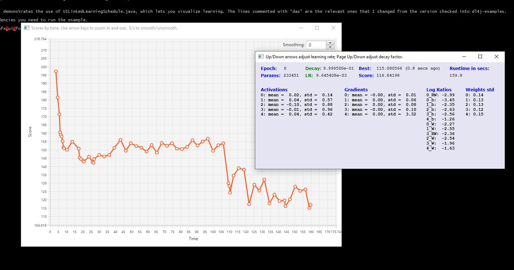
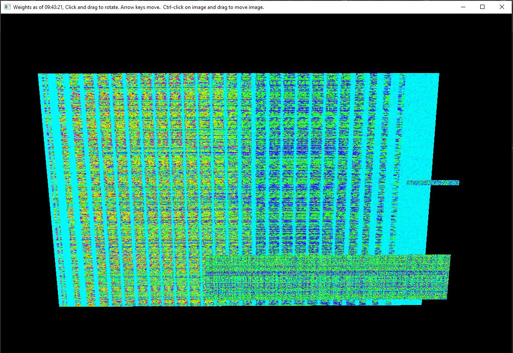
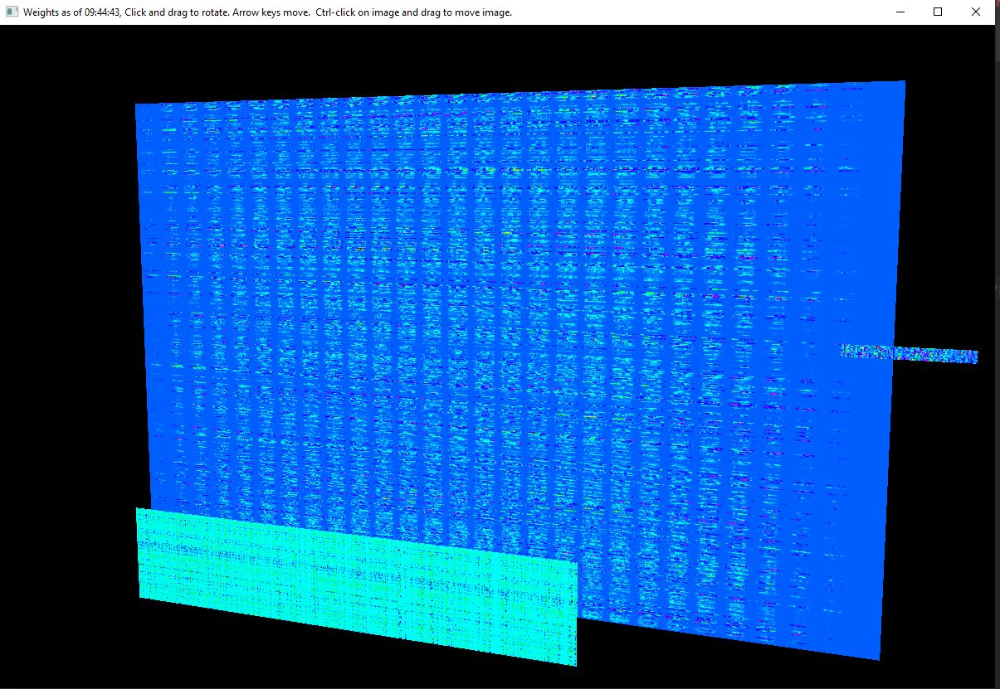

#JavaFX UI for deeplearning4j  https://deeplearning4j.org/

Like dl4j's UIServer, it shows score, gradients, activations, weights, and log mean ratios of updates to parameters, per layer.

It has an associated LearningSchedule which you can control from the UI. You can adjust the LearningRate (Up/Down arrows), as well as the decay factor of the learning rate (Page Up/Down). It's nice to see the ratios change when you do that.

It shows an image of weights (params) per layer in 3D, via WeightsImageStage.java. You can rotate the scene by clicking and dragging with the mouse. You can navigate with arrow keys. (Ctrl and shift change effect.) You can move an individual image by ctrl-clicking and dragging.

It uses StatsStorage to get the ratios of updates to parameters. 

The score chart uses JavaFX LineChart, so it has built-in functionality and prettiness.  The score chart lets you smooth the line to better see long-term trends. (Spinner at upper-right.)

`TrainingListenerWithUI.java` is the main class. (You'll want to put it in an appropriate package in dl4j.)

`GenerateTxtModelWithJavaFXUI.java` is a demo of how to use it in a dl4j learning app; the lines commented with "das" are the relevant ones that I changed from the version checked into dl4j-examples.

`MNISTDoubleLayerWithUI.java` shows an example of the UI with MNIST learning.

pom.xml includes the javafx dependencies you need to run the example.

https://github.com/DonaldAlan/javafx_ui_for_deeplearning4j

Limitation: only works with MultiLayerNetwork. Doesn't show all pararms that are not of rank 2.

Don Smith (ThinkerFeeler@gmail.com)
